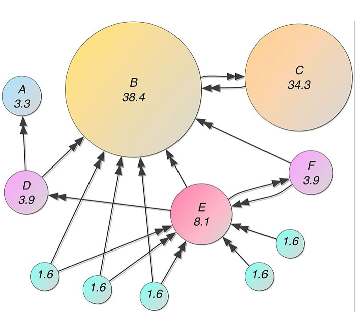
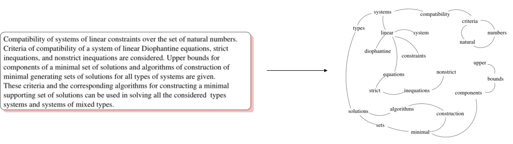
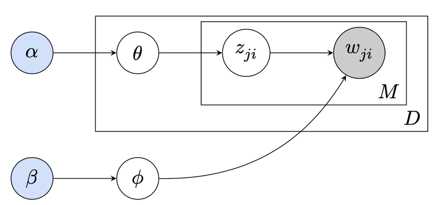

# 关键词提取

### TF-IDF

两种计算方式

前提：去除停用此

重要性的确定：在一个文本中一个词出现的次数越多越重要

在多个文本文档中如果某个词出现的越少越重要，出现的越多，越不那么重要

TF：一段文本中一个词出现的次数

计算句子的相似度

setence=[w1,....wn]

s_tf=[t1....tn]

维度要一样

（1）截断/padding

（2）只拿句子的tf-idf中前几个词

### Text-Rank（Graph based extraction）

Text-Rank是基于Page-rank的

Page rank:假设一个网页链接的重要网络越多，那么这个网页越重要

PR---->重要行

init
$$
t = 0
$$

$$
PR(p_i,0)=\frac{1}{N}
$$

$$
N为总的网页数目
$$

iterator
$$
PR(P_i,t+1) =\left(1-d\right)*\sum_{j\in\left(P_i\right)}\frac{1}{|Out\left(P_j\right)|}PR\left(P_j,t\right)
$$

Eg:

$$
PR(B,t)=(1-d)+d*(\frac{PR(D,t-1)}{2}+\frac{PR(G,t-1)}{2}+\frac{PR(H,t-1)}{2}+\frac{PR(I,t-1)}{2}+\frac{PR(E,t-1)}{3}+\frac{PR(F,t-1)}{2}+\frac{PR(C,t-1)}{1})
$$
d一般赋值给0.85

基于pageRank-TextRank

基于滑动窗口，假设窗口是3，文本
$$
[w_1,w_2,w_3,w_4,w_5........w_n]
$$

$$
(w_1,w_2)(w_1,w_3)
(w_2,w_3)(w_2,w_4)
....
$$

是个无向图
$$
(w_1,w_2)
$$
是有权重的，这个权重一般为两个词的相似度，可以用两个词的cos值来衡量，cos(w_1,w_2)

$$
WS(V_i)=(1-d)*d\sum_{j\in In(V_i)}\frac{w_{ji}}{\sum_{v_k\in Out(V_j)}{w_{jk}}}{WS(V_j)}
$$

### LDA topic Model

假设：

1、一个文本的主题服从某一个分布

一个问题本的主题：金融类 战争类 旅游类

2、每个主题下的词服从一个分布

金融类：股票 债券 基金...

$$
z_{ji}
$$
每个词的可能的主题
$$
w_{ji}
$$
第j个文本里第i个位置的词
$$
M
$$
M-一个文本里面的词
$$
D
$$
D-表示文本

地雷克烈分布
$$
\theta
$$
每个文本里主题的分布
$$
\phi
$$
每个主题下词的分布
$$
\alpha
$$

$$
\beta
$$
都是地雷克烈分布

没看到文本的时候都是地雷克烈分布

看到文本后开始迭代

### word vector

会用到k-means

（1）训练一个模型学习词向量

（2）使用k-mans算法聚合词

（3）计算每个词的属于簇的距离

（4）选择前k个词作为关键词 

# 命名实体识别

DL Based named entity recognition

可以看作是一个seq2seq的一种

我昨天去北京爬长城----->seq2seq(RNN CRU LSTM)+分类器

pyltp:做识别

# 依存分析

两种分析方式：

语法上进行分析

语意上分析

pyltp 也可做

# nlp相关任务

分类

文本分类

文本表示：

tf-idf;

word-vector 

word +RNN

机器学习：

朴素贝叶斯：

去除停用词，选取关键词，贝叶斯，

生成

