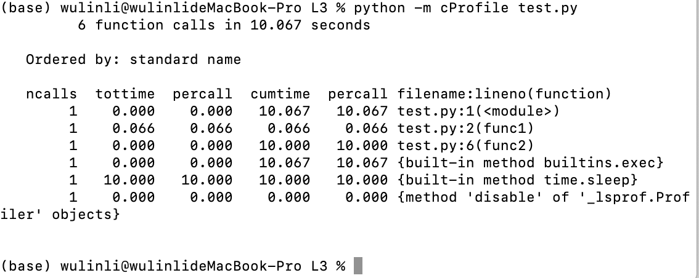
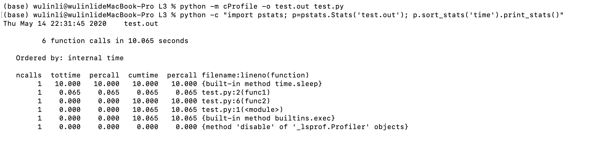
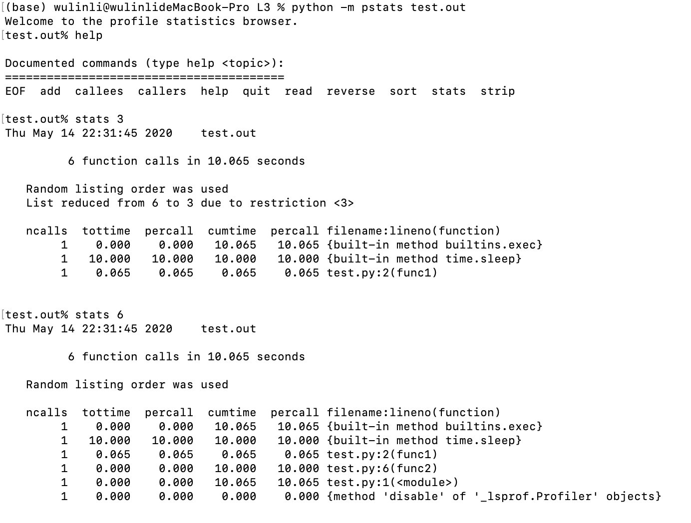

# 异常处理

#### 简单异常模板

```python
#简单异常
try:
  pass
except:
  pass
  
  
try:
  pass
except:
  pass
else:#没有异常的情况下执行else下面的语句
  pass


try:
  pass
except:
  pass
finally:#不论有无异常都执行finally后面的语句
  pass

try:
  pass
except:
  pass
else:
  pass
finally:
  pass

```

##### 自定义异常类

自定义异常类需要定义有意义的异常类

```python
#知识点：如何自定义类
class MyException(Exception):                   #让MyException类继承Exception
    def __init__(self,name,age):
        self.name = name
        self.age = age
try:
    #知识点：主动抛出异常，就是实例化一个异常类
    raise MyException("zhansgan",19)            #实例化一个异常,实例化的时候需要传参数
except MyException as obj:                      #这里体现一个封装，
    print(obj.age,obj.name)                     #捕获的就是MyException类携带过来的信息
except Exception as obj:                        #万能捕获，之前的可能捕获不到，这里添加Exception作为保底
    print(obj)
```


# 上下文处理

```python
try:
    f = open('test.txt')
    for lines in f.readlines():
        print(lines)
except Exception as e:
    print(e)
finally:
    f.close()
    
f.closed#True
```

with就是实现的一个上下文

```python
with open('test.txt') as fr:
    for lines in fr.readlines():
        print(lines)
f.closed#True        
```

#### 什么是上下文管理器

一个类，实现了下面两个协议，那么这个类就是上下文管理器

- \_\_enter\_\_

\_\_exit__
就是上下文管理器


上下文管理器为with而生；当with语句在开始运行时，会在上下文管理器对象上调用 __enter__ 方法。with语句运行结束后，会在上下文管理器对象上调用 __exit__ 方法

总结什么时候可以使用上下文管理器:

1.调用方法A

2.执行一段代码

3.调用方法B

##### 上下文管理器实现计时功能

```python
import time
class TimeRecord:
    def __init__(self):
        self.__start = 0
        self.__end = 0
    
    def __enter__ (self):
        self.__start = time.time()
        return "lala"
    
    def __exit__(self,exc_type, exc_val, exc_tb):
        self.__end = time.time()
        print(f"the fuction cost {self.__end-self.__start} s.")
```

```python
def hello_world():
    print("hello world")
with TimeRecord() as t:
    hello_world()
#hello world
#the fuction cost 0.00021600723266601562 s.    
```


# 性能优化-时间

示例：

```python
from copy import deepcopy
from random import shuffle
s="""
A wiki is run using wiki software, otherwise known as a wiki engine. A wiki engine is a type of content management system, but it differs from most other such systems, including blog software, in that the content is created without any defined owner or leader, and wikis have little inherent structure, allowing structure to emerge according to the needs of the users.[2] There are dozens of different wiki engines in use, both standalone and part of other software, such as bug tracking systems. Some wiki engines are open source, whereas others are proprietary. Some permit control over different functions (levels of access); for example, editing rights may permit changing, adding, or removing material. Others may permit access without enforcing access control. Other rules may be imposed to organize content.

The online encyclopedia project Wikipedia is the most popular wiki-based website, and is one of the most widely viewed sites in the world, having been ranked in the top ten since 2007.[3] Wikipedia is not a single wiki but rather a collection of hundreds of wikis, with each one pertaining to a specific language. In addition to Wikipedia, there are hundreds of thousands of other wikis in use, both public and private, including wikis functioning as knowledge management resources, notetaking tools, community websites, and intranets. The English-language Wikipedia has the largest collection of articles: as of February 2020, it has over 6 million articles. Ward Cunningham, the developer of the first wiki software, WikiWikiWeb, originally described wiki as "the simplest online database that could possibly work".[4] "Wiki" (pronounced [ˈwiki][note 1]) is a Hawaiian word meaning "quick".[5][6][7]
"""

str_list = s.split(" ")
new_list = deepcopy(str_list)
shuffle(new_list)
targets = new_list[100:200]
```

## 工具查看代码内部运行时间

- cProfile 内置-时间性能分析工具

使用方法参考网址：https://www.cnblogs.com/kaituorensheng/p/4453953.html

-  查看函数耗费时间-按照函数名名排序

```python
python -m cProfile test.py
```




- 打印内容输出到

```python
python -m cProfile -o test.out test.py
```

- 按照耗时排序

  ```python
  python -c "import pstats; p=pstats.Stats('test.out'); p.sort_stats('time').print_stats()"
  ```

  Sort_stats的参数`calls, cumulative, file, line, module, name, nfl, pcalls, stdname, time`

  

- pstats模块还支持交互式

  ```python
  python -m pstats test.out
  ```

  

  

## 优化常用的方法

- 使用函数去处理
- 全局与局部变量, 局部变量操作比全局变量要快
- dict O(1)  list O(n) 数据量比较大可以用dict
- set操作
- 使用生成器generator
- 内存换取时间

### 查找法求交集目标元素

- 直接查找

```python
def find_target_without_dict(items,targets):
    for _ in range(10000):
        count = 0
        for item in items:
            if item in targets:
                count = count + 1
            
with TimeRecord():
    find_target_without_dict(new_list,targets)
    
#the fuction cost 1.9188902378082275 s.
```


- 使用dic查找

  主要是用的是dict.fromkeys

```python
def find_target_with_dict(items,targets):
    items = dict.fromkeys(items,1)
    for _ in range(10000):
        count = 0
        for item in items:
            if item in targets:
                count = count + 1
            
with TimeRecord():
    find_target_with_dict(new_list,targets)
#the fuction cost 1.4617741107940674 s.
```


### 求交集

- 直接求交集

```python
def get_same_without_set(items,targets):
    for _ in range(10000):
        l=[]
        for item in items:
            if item in targets:
                l.append(item)
                
with TimeRecord():
    get_same_without_set(new_list,targets)
#the fuction cost 2.0060763359069824 s.
```


- set求交集

```python
def get_same_with_set(items,targets):
    for _ in range(10000):
        l=[]
        items = set(items)
        targets = set(targets)
        l.append(items&targets)
                
with TimeRecord():
    get_same_with_set(new_list,targets)
    
#the fuction cost 0.05556511878967285 s.
```

## 生成器generator

```python

def get_same_with_generator(items,targets):
    for _ in range(10000):
        l = []
        res = ( item for item in items if item in targets)
        l.append(res)
with TimeRecord():
    get_same_with_generator(new_list,targets)
#the fuction cost 0.005185127258300781 s.
```


### 内存换取时间

### 工具查看代码内存占用情况

- memory_profiler (需要另外安装) -内存性能分析工具

### 优化常用方法

- 缓存

  - 简单缓存机制

  ```python
  _CACHE ={}
  from math import sin
  def cache_sin(x):
      if x in _CACHE:
          return _CACHE[x]
      else:
          _CACHE[x]=sin(x)
          return _CACHE[x]
  ```

  - 装饰器缓存

    - 不使用缓存

      ```python
      def fib(n):
          return 1 if n<2 else fib(n-1)+fib(n-2)
      with TimeRecord():
          fib(35)
      #the fuction cost 3.7019307613372803 s.   
      ```

      

    - 使用缓存

      ```python
      from functools import lru_cache
      @lru_cache(maxsize=128)
      def fib_cache(n):
          return 1 if n<2 else fib_cache(n-1)+fib_cache(n-2)
      with TimeRecord():
          fib_cache(35)
      #the fuction cost 2.8848648071289062e-05 s.
      ```

      ```python	
      _FIB_CACHE={
          0:1,
          1:1
      }
      def _fib_cache(n):
          if n in _FIB_CACHE:
              return _FIB_CACHE[n]
          else:
              _FIB_CACHE[n] = _fib_cache(n-1)+_fib_cache(n-2)
              return _FIB_CACHE[n]
          
      with TimeRecord():
          _fib_cache(35)  
          
      # the fuction cost 2.5987625122070312e-05 s.
      ```

      

- \_\_slots\_\_

  使用该方法：对象中的\_\_dict\_\_ 方法消失 \_\_slots\_\_(x,y)限定这个对象中只有x和y两个变量

  优势（1）限定对象中的成员变量（2）降低内存消耗

# 打包与发布

- 主流打包工具setuptools：

​	pip list|grep setuptools

- 构建模块setup.py

  ```python
  # try:
  from pip._internal.req import parse_requirements
  # except ImportError:
  
      # from pip.req import parse_requirements
  from setuptools import find_packages
  from setuptools import setup
  
  
  
  requirements = [str(ir.req) for ir in parse_requirements("requirements.txt",session=False)]
  setup(
  
  	name="vector",
      version="0.0.1",
      description="vector",
      packages = find_packages(exclude=[]),
      author="wulinli",
      author_email="wulinli@kedacom.com",
      license="",
      package_data={'':['*.*']},
      url="",
      install_requires=requirements,
      zip_safe = False,
      classifiers=[
          "Programming Language::Python",
          "Programming Language::Python 3.7",
          "Operating System::Unix",
          "Operating System::Microsoft::Windows",
  
  
      ]
  )
  ```

  

- 导出依赖包

  `pip freeze > requirements `

- 安装

  `python setup.py install`

  

- 卸载

  `pip uninstall pacakge`


#### 包的在线发布

通过pip install 包名称  ==》完成程序包的移植安装
 标准模块构建管理网站 http://pypi.python.org
 在网站进行账号注册

发布程序包：需要第三方模块的支持[twine]
 1.安装命令
 ->pip install twine
 2.发布自己的程序包
 twine upload dist/*
 输入账号=》
 输入密码=》
 3.其他人安装命令
 ->pip install 程序信息
 4.卸载命令
 ->pip uninstall 信息