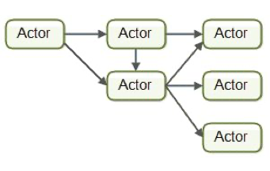

# 并行编程

## 并行编程模型

### 多线程/多进程模型

#### 多线程模型

特点：多个线程共享一个内存

使用场景：

​			IO密集型任务----->读取文件、下载网页、键盘输入等

优点：开销小，线程之间的切换基本无缝对接

#### 多进程模型

特点：各进程独自占用一个内存

使用场景：

​		CPU密集型任务----->计算（有的情况下也可用IO型）

优点：拥有独立的空间、充分利用多核、开销比线程大

#### 同步问题

#### 死锁问题

### 消息传递模型

#### Actor模型

##### Actor模型简介

系统中所有事物都抽象成为一个Actor：

- Actor的输入是接收到的消息
- Actor接收到消息后处理消息中定义的任务
- Actor处理完成任务后可以发送消息给其它Actor

##### Actor组成

Actor是由状态（state）、行为（behavior）、邮箱（mailbox）三者组成的。

- 状态（state）：状态是指actor对象的变量信息，状态由actor自身管理，避免并发环境下的锁和内存原子性等问题。
- 行为（behavior）：行为指定的是actor中计算逻辑，通过actor接收到的消息来改变actor的状态。
- 邮箱（mailbox）：邮箱是actor之间的通信桥梁，邮箱内部通过FIFO消息队列来存储发送发消息，而接收方则从邮箱中获取消息。

优点：

不用考虑多线程内部共享内存问题

一个

#### 

#### CSP模型

### 数据并行模型

### master-worker模型

