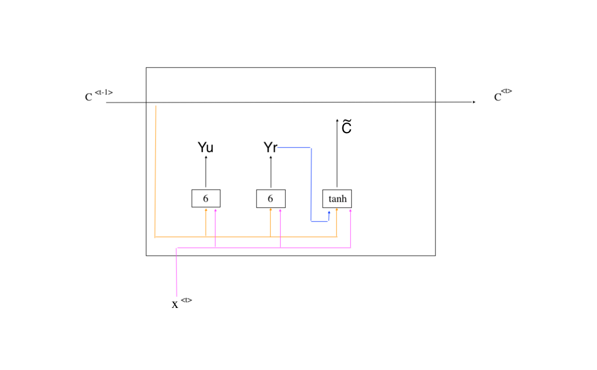

# \Recurrent Nature Network（RNN）

## 涉及到的内容

### 概念

序列

RNN

RNN拓展

### NN的变种

LSTM

GRU

### 迁移学习

## 序列 

之前的神经网络：

输入的feature中没有什么联系，例如房间的数量、位置等

还有一些的输入输出

### 序列问题

输入的是个序列，输出也是序列

- 机器翻译-------输入句子，输出句子

- 语音识别------输入的语音信号，输出事这个语音信号的意思

- 命名实体的识别----识别人名、公司名、等

- DNA序列分析

输入序列，输出值

- 情感分析

FCN解决序列问题-----命名实体的识别

输入：李诞转发杨超越

X：李诞 	转发	杨超越

Y：1	0	1

词的表示：one-hot representation

两个问题：

输入输出可能是不同的维度（句子切割的长度不一样）；而传统的神经网络的输入输出的是固定的

feature之间不会相互传递或者连接；李诞说他昨天转发了杨超越；他指代的谁

词典很大，输入的维度很大，参数量大，若干层就更大

解决：RNN

## RNN相关概念

原始RNN网络图

展开后

# RNN变种-解决梯度消失

- Gated Recurrent Unit（GRU）（Simple）

$$ c^{<t>} $$ 是一个memoryCell，即存储单元，有的用$$ h $$表示

$$ \tilde{c} = tanh(w_c[c^{<t-1>},x^{<t>}]+b_c) $$ 是候选的新入信息，其值代表了当前时间点，所需要存储的候选值信息

$$ \gamma u = \sigma(w_u[c^{<t-1>},x^{<t>}]+b_a) $$ 根据前面的信息，判定有多少信息需要保留（update gate ------ 更新门）

$$c^{<t>}=\gamma u*\tilde{c}^{<t>}+(1-\gamma u)*c^{<t-1>} $$ 左项表示新进来的信息需要保留$$ \gamma u$$，右项表示，前一个时间点的信息需要保留$$(1-\gamma u) $$

- Gated Recurrent Unit（GRU）（FUll）

$$ \gamma u = \sigma(w_u[c^{<t-1>},x^{<t>}]+b_u) $$  update gate 更新门

$$ \gamma r = \sigma(w_r[c^{<t-1>},x^{<t>}]+b_r) $$  reset gate  重置门

$$ \tilde{c} = tanh(w_c[\gamma r c^{<t-1>},x^{<t>}]+b_c) $$ 是候选的新入信息，其值代表了当前时间点，所需要存储的候选值信息

$$c^{<t>}=\gamma u*\tilde{c}^{<t>}+(1-\gamma u)*c^{<t-1>} $$ 左项表示新进来的信息需要保留$$ \gamma u$$，右项表示，前一个时间点的信息需要保留$$(1-\gamma u) $$

- LSTM（Long short time memory）

- Bidirectional RNN

- Depp RNN 

  

## transfer learning 迁移学习

