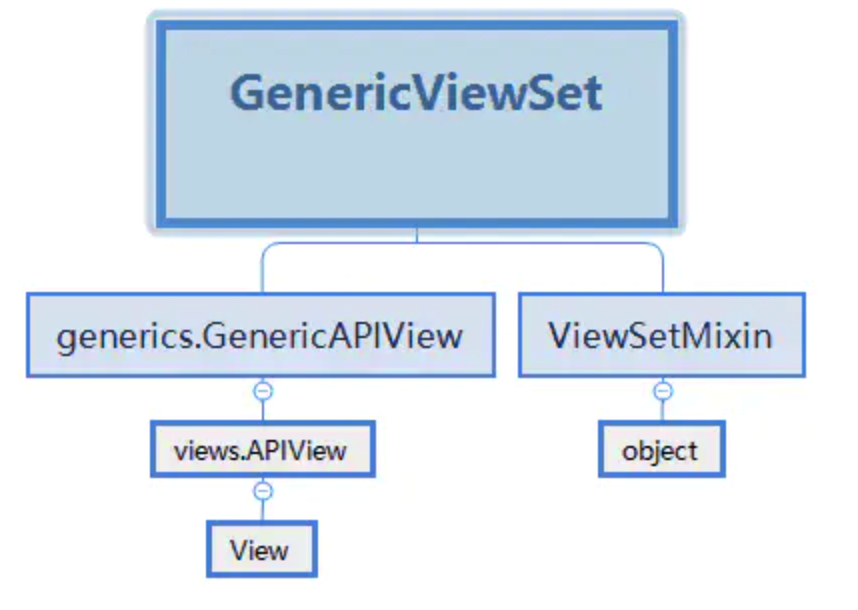
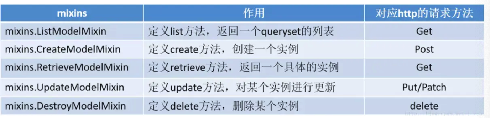

# Django 工程创建

## 环境搭建

前提 python

```
pip install Django
```

安装 Django 之后，您现在应该已经有了可用的管理工具 **django-admin**。我们可以使用 **django-admin** 来创建一个项目

## 创建工程

django-admin命令详情

```
$ django-admin
Type 'django-admin help <subcommand>' for help on a specific subcommand.

Available subcommands:

[django]
    check
    compilemessages
    createcachetable
    dbshell
    diffsettings
    dumpdata
    flush
    inspectdb
    loaddata
    makemessages
    makemigrations
    migrate
    runserver
    sendtestemail
    shell
    showmigrations
    sqlflush
    sqlmigrate
    sqlsequencereset
    squashmigrations
    startapp
    startproject
    test
    testserver
……省略部分……
```

```
django-admin startproject HelloWorld
```

```
$ cd HelloWorld/
.
|-- HelloWorld
|   |-- __init__.py
|   |-- settings.py
|   |-- urls.py
|   `-- wsgi.py
`-- manage.py
```

- **HelloWorld:** 项目的容器。

- **manage.py:** 一个实用的命令行工具，可让你以各种方式与该 Django 项目进行交互。

- **HelloWorld/__init__.py:** 一个空文件，告诉 Python 该目录是一个 Python 包。

- **HelloWorld/settings.py:** 该 Django 项目的设置/配置。

- **HelloWorld/urls.py:** 该 Django 项目的 URL 声明; 一份由 Django 驱动的网站"目录"。

- **HelloWorld/wsgi.py:** 一个 WSGI 兼容的 Web 服务器的入口，以便运行你的项目。

  

  `python manage.py runserver` 

# 视图和URL配置

HelloWorld 目录新建一个 view.py 文件

```
from django.http import HttpResponse
 
def hello(request):
    return HttpResponse("Hello world ! ")
```

绑定url与视图

```
from django.conf.urls import url
 
from . import view
 
urlpatterns = [
    url(r'^$', view.hello),
]
```

除了url可以绑定外 还可以 path re_path（2.0）绑定；

```
path(route, view, kwargs=None, name=None)
```


## 数据库配置

```
sudo pip install mysqlclient
```

在项目的 settings.py 文件中找到 DATABASES 配置项，将其信息修改为：

```json
DATABASES = {    
  'default': {        
    'ENGINE': 'django.db.backends.mysql',  // 或者使用 mysql.connector.django        
    'NAME': 'test',        
    'USER': 'test',        
    'PASSWORD': 'test123',        
    'HOST':'localhost',        
    'PORT':'3306',    
  } 
}
```

# 建立模型


```
django-admin startapp TestModel
```

```
HelloWorld
|-- TestModel
|   |-- __init__.py
|   |-- admin.py
|   |-- models.py
|   |-- tests.py
|   `-- views.py
```

 TestModel/models.py 文件，代码如下

```
# models.py 
from django.db import models  
class Test(models.Model):    
	name = models.CharField(max_length=20)
	class Meta:
		db_table = "test_model"
```

以上的类名代表了数据库表名，且继承了models.Model，类里面的字段代表数据表中的字段(name)，数据类型则由CharField（相当于varchar）、DateField（相当于datetime）， max_length 参数限定长度

db_table定义了表名，没有meta，将默认表名组成结构为：应用名_类名（如：TestModel_test）

**INSTALLED_APPS**配置

在settings.py中找到INSTALLED_APPS这一项

```
INSTALLED_APPS = (
    'django.contrib.admin',
    'django.contrib.auth',
    'django.contrib.contenttypes',
    'django.contrib.sessions',
    'django.contrib.messages',
    'django.contrib.staticfiles',
    'TestModel',               # 添加此项
)
```

执行migrate创建表

```
python manage.py makemigrations
python manage.py migrate
```

只要修改了模型都要进行migrate操作，否则不能应用到数据库

# 基本数据库操作

在 HelloWorld 目录中添加 testdb.py 文件（下面介绍），并修改 urls.py

### 查询

```
# -*- coding: utf-8 -*-
 
from django.http import HttpResponse
 
from TestModel.models import Test
 
# 数据库操作
def testdb(request):
    # 初始化
    response = ""
    response1 = ""
    
    
    # 通过objects这个模型管理器的all()获得所有数据行，相当于SQL中的SELECT * FROM
    list = Test.objects.all()
        
    # filter相当于SQL中的WHERE，可设置条件过滤结果
    response2 = Test.objects.filter(id=1) 
    
    # 获取单个对象
    response3 = Test.objects.get(id=1) 
    
    # 限制返回的数据 相当于 SQL 中的 OFFSET 0 LIMIT 2;
    Test.objects.order_by('name')[0:2]
    
    #数据排序
    Test.objects.order_by("id")
    
    # 上面的方法可以连锁使用
    Test.objects.filter(name="runoob").order_by("id")
    
    # 输出所有数据
    for var in list:
        response1 += var.name + " "
    response = response1
    return HttpResponse("<p>" + response + "</p>")
```


### 增加

```
from django.http import HttpResponse
 
from TestModel.models import Test
 
# 数据库操作
def testdb(request):
    test1 = Test(name='runoob')
    test1.save()
    return HttpResponse("<p>数据添加成功！</p>")
```


### 删除

```
 
from django.http import HttpResponse
 
from TestModel.models import Test
 
# 数据库操作
def testdb(request):
    # 删除id=1的数据
    test1 = Test.objects.get(id=1)
    test1.delete()
    
    # 另外一种方式
    # Test.objects.filter(id=1).delete()
    
    # 删除所有数据
    # Test.objects.all().delete()
    
    return HttpResponse("<p>删除成功</p>")
```


### 修改

```
from django.http import HttpResponse
 
from TestModel.models import Test
 
# 数据库操作
def testdb(request):
    # 修改其中一个id=1的name字段，再save，相当于SQL中的UPDATE
    test1 = Test.objects.get(id=1)
    test1.name = 'Google'
    test1.save()
    
    # 另外一种方式
    #Test.objects.filter(id=1).update(name='Google')
    
    # 修改所有的列
    # Test.objects.all().update(name='Google')
    
    return HttpResponse("<p>修改成功</p>")
```


# Django 数据迁移

1. django 项目提供了一个导出的方法 python manage.py dumpdata, 不指定 appname 时默认为导出所有的app

```python
python manage.py dumpdata [appname] > appname_data.json
```

比如我们有一个项目叫 mysite, 里面有一个 app 叫 blog ,我们想导出 blog 的所有数据

```pyt
python manage.py dumpdata blog > blog_dump.json
```

2. 数据导入,不需要指定 appname

```python
python manage.py loaddata blog_dump.json
```

备注：一些常用的

```python
python manage.py dumpdata auth > auth.json ``# 导出用户数据
```

优点：可以兼容各种支持的数据库，也就是说，以前用的是 SQLite3，可以导出后，用这种方法导入到 MySQL, PostgreSQL等数据库，反过来也可以。

缺点：数据量大的时候，速度相对较慢，表的关系比较复杂的时候可以导入不成功。


# Django restframework

几种view以及他们之间的关系。



其中，还涉及了mixins，主要也分为5类



### 自带view

```python
# drf是通过json的格式进行数据交互的，所以这里也返回json数据
import json
from django.views.generic.base import View
from django.core import serializers
from django.http import HttpResponse,JsonResponse
from .models import Course

class CourseListView(View):
    def get(self, request):
        """
        通过django的view实现课程列表页
        """
        courses = Course.objects.all()[:10]
        json_data = serializers.serialize('json', Courses)
        json_data = json.loads(json_data)
        return JsonResponse(json_data, safe=False)
```

### APIview

```python
from rest_framework.views import APIView
from rest_framework.response import Response
# 这个serializers是在其他文件自定义的
from .serializers import CourseSerializer
class CourseSerializer(serializers.ModelSerializer):
    class Meta:
        model = CourseModel  # 设置关联模型     model就是关联模型
        fields = '__all__'  # fields设置字段   __all__表示所有字段
        
class CourseListView(APIView):
    def get(self, request, format=None):
        """
        通过APIView实现课程列表页
        """
        courses = Course.objects.all()
        serializer = CourseSerializer(courses, many=True)
        return Response(serializer.data)
```

### GenericAPIView

```
from rest_framework.generics import GenericAPIView
```

GenericAPIView继承 APIView，主要增加了操作序列化器和数据库查询的方法，作用是为下面Mixin扩展类的执行提供方法支持。通常在使用时，可搭配一个或多个Mixin扩展

因此也是需要进行序列化的三个步骤，但是是使用GenericAPIView的时候，必须要有一个前提，就是：必须申明当前视图类中操作的模型数据是

```
queryset = BookInfo.objects.all()  # 必须申明当前视图类中操作的模型数据是什么，
```


也可以选择性的增加 `serializer_class = BookInfoModelSerializer`  # 可以声明当前要调用的序列化器是什么

```python
from rest_framework import mixins
from rest_framework import generics
class CourseListView(generics.GenericAPIView):
    """
    课程列表页
    """
    queryset = Course.objects.all()
    serializer_class= CourseSerializer #注意命名不能有差池
    def get(self, request, *args, **kwargs):  
        # 第一步：操作数据 获取所有数据
        query_set = self.get_queryset()
        # 第二步  序列化
        serializer = self.get_serializer(query_set, many=True)
        # 第三步L：响应数据
        return Response(serializer.data)
        return self.list(request, *args, **kwargs)
```

```python
#以图书为例子
# URL. /books/(?P<pk>\d+)/
class BookDetailView(GenericAPIView):
    """
    获取、修改、删除指定图书
    """
    # 指定视图所使用的序列化器类
    serializer_class = BookInfoSerializer
    # 指定视图所使用的查询集
    queryset = BookInfo.objects.all()

    def get(self, request, pk):
        """
        获取指定图书
        """
        instance = self.get_object()

        # 将图书数据进行序列化
        serializer = BookInfoSerializer(instance)

        return Response(serializer.data)

    def put(self, request, pk):
        """
        修改指定图书
        """
        instance = self.get_object()

        # 反序列化-数据校验
        serializer = BookInfoSerializer(instance, data=request.data)
        serializer.is_valid(raise_exception=True)

        # 反序列化-数据保存(save内部会调用序列化器类的update方法)
        serializer.save()

        return Response(serializer.data)

    def delete(self, request, pk):
        """
        删除指定图书：
        """
        instance = self.get_object()
        instance.delete()
        return Response(status=status.HTTP_204_NO_CONTENT)

```

