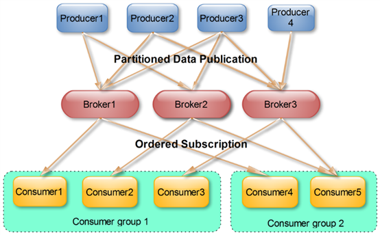

# kafka简介

Kafka是最初由Linkedin公司开发，是一个分布式、支持分区的（partition）、多副本的（replica），基于zookeeper协调的分布式消息系统，它的最大的特性就是可以实时的处理大量数据以满足各种需求场景：比如基于hadoop的批处理系统、低延迟的实时系统、storm/Spark流式处理引擎，web/nginx日志、访问日志，消息服务等等，用scala语言编写，Linkedin于2010年贡献给了Apache基金会并成为顶级开源项目。

***

# Kafa 特性

- 高吞吐量、低延迟：kafka每秒可以处理几十万条消息，它的延迟最低只有几毫秒，每个topic可以分多个partition, consumer group 对partition进行consume操作。

- 可扩展性：kafka集群支持热扩展

- 持久性、可靠性：消息被持久化到本地磁盘，并且支持数据备份防止数据丢失

- 容错性：允许集群中节点失败（若副本数量为n,则允许n-1个节点失败）

- 高并发：支持数千个客户端同时读写

***

# Kafak使用场景

- 日志收集：一个公司可以用Kafka可以收集各种服务的log，通过kafka以统一接口服务的方式开放给各种consumer，例如hadoop、Hbase、Solr等。

- 消息系统：解耦和生产者和消费者、缓存消息等。

- 用户活动跟踪：Kafka经常被用来记录web用户或者app用户的各种活动，如浏览网页、搜索、点击等活动，这些活动信息被各个服务器发布到kafka的topic中，然后订阅者通过订阅这些topic来做实时的监控分析，或者装载到hadoop、数据仓库中做离线分析和挖掘。

- 运营指标：Kafka也经常用来记录运营监控数据。包括收集各种分布式应用的数据，生产各种操作的集中反馈，比如报警和报告。

- 流式处理：比如spark streaming和storm事件源

***

# Kafka相关概念

- Producer生产者

  生产者即数据的发布者，该角色将消息发布到Kafka的topic中。broker接收到生产者发送的消息后，broker将该消息**追加**到当前用于追加数据的segment文件中。生产者发送的消息，存储到一个partition中，生产者也可以指定数据存储的partition。

- Consumer消费者

  消费者可以从broker中读取数据。消费者可以消费多个topic中的数据。

- ConsumerGroup消费组

  

- Broker缓存代理

  Kafka 集群包含一个或多个服务器，服务器节点称为broker。

  broker存储topic的数据。如果某topic有N个partition，集群有N个broker，那么每个broker存储该topic的一个partition。

  如果某topic有N个partition，集群有(N+M)个broker，那么其中有N个broker存储该topic的一个partition，剩下的M个broker不存储该topic的partition数据。

  如果某topic有N个partition，集群中broker数目少于N个，那么一个broker存储该topic的一个或多个partition。在实际生产环境中，尽量避免这种情况的发生，这种情况容易导致Kafka集群数据不均衡。

- Topic主题

  每条发布到Kafka集群的消息都有一个类别，这个类别被称为Topic。（物理上不同Topic的消息分开存储，逻辑上一个Topic的消息虽然保存于一个或多个broker上但用户只需指定消息的Topic即可生产或消费数据而不必关心数据存于何处）

- Partition分组

  topic中的数据分割为一个或多个partition。每个topic至少有一个partition。每个partition中的数据使用多个segment文件存储。partition中的数据是有序的，不同partition间的数据丢失了数据的顺序。如果topic有多个partition，消费数据时就不能保证数据的顺序。在需要严格保证消息的消费顺序的场景下，需要将partition数目设为1。

  

- Leader

  每个partition有多个副本，其中有且仅有一个作为Leader，Leader是当前负责数据的读写的partition。

- Follower

Follower跟随Leader，所有写请求都通过Leader路由，数据变更会广播给所有Follower，Follower与Leader保持数据同步。如果Leader失效，则从Follower中选举出一个新的Leader。当Follower与Leader挂掉、卡住或者同步太慢，leader会把这个follower从“in sync replicas”（ISR）列表中删除，重新创建一个Follower。

- Message消息

***

# kafka生产者发送机制

- 发送并忘记

  不关注消息是否正常到达，不对返回结果做处理

  

- 同步发送

  通过get方法等待kafka的响应，判断消息是否发送成功

  消息未成功达到会阻塞

  

- 异步发送+回调

  消息未成功达到，不阻塞，通过回调函数处理错误信息

  

***

# kafka消费模型

- 从上次消费的位置消费
- 从最新消息处消费
- 从头开始消费
- 指定位置开始消费
- 批量消费

***

# kafka提交机制

- 自动提交
- 同步提交
- 异步提交
- 同步+异步组合

***

# kafka消费模型

- 最多一次
- 最少一次
- 正好一次

***

# kafka优化性能

