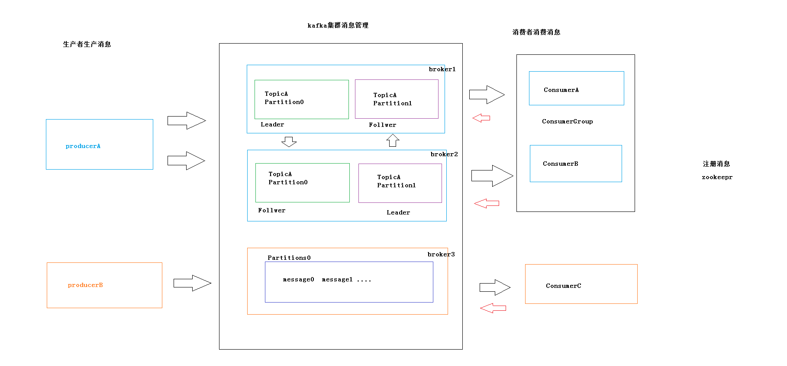

# kafka简介

Kafka是最初由Linkedin公司开发，是一个**分布式**、**支持分区的**（partition）、**多副本的**（replica），基于zookeeper协调的分布式消息系统，它的最大的特性就是可以实时的处理大量数据以满足各种需求场景：比如基于hadoop的批处理系统、低延迟的实时系统、storm/Spark流式处理引擎，web/nginx日志、访问日志，消息服务等等，用scala语言编写，Linkedin于2010年贡献给了Apache基金会并成为顶级开源项目。

一个**分布式**的基于**发布/订阅**模式的消息队列，主要应用于大数据**实时**处理领域。

***

# 消息队列介绍

### 传统消息队列的应用场景

#### 同步处理

#### 异步处理

#### 优势

- 解耦

允许你独立的扩展或修改两边的处理过程，只要确保他们遵守同样的接口约束

- 可恢复性

系统的 一部分组件失效时，不会影响到整个系统。消息队列降低了进程之间的耦合度，所以即使一个处理消息的进程挂掉，加入队列中的消息仍然可以在系统恢复后继续处理。

- 缓存

有助于控制和优化数据流经过系统的速度，解决生产消息和消费消息的处理速度不一致的情况。

- 灵活性&峰值处理能力

在访问数据量暴增的情况下，应用仍然需要继续发挥作用，但是这样的突发流量不常见，如果为已能力处理这类峰值访问为标准投入资源随时待命无疑是巨大的浪费，使用消息队列能够使关键组件叮嘱突发的访问压力，而不会因为突发的超负荷的请求而完全崩溃。

- 异步通信

  很多时候，用户不想也不需要立即处理消息。消息队里提供了异步处理机制，允许用户把一个消息放入队列，但并不立即处理它。想向队列中放入多少消息就放多少消息然后再需要的时候去处理它

-------------

# 消息队列的两种模式

- 点对点模式（**一对一**，消费者主动拉取数据，消息收到后消息清除）

  消息生产者生产消息发送到queue中，然后消息消费者从queue中取出并且消费消息，消息被消费后，queue中不再有存储，所以消息消费者不可能消费到已经被消费的消息。queue支持存在多个消费者，但是对一个消息而言只会有一个消费者可以消费

- 发布订阅模式（**一对多**，消费者消费数据之后，不会消除消息）

  消费者生产（发布）将消息发布到topic中，同时有多个消息消费者（订阅）消费该消息，和点对点方式不同，发布到topic的消息会被所有订阅者消费者。

  

  根据生产速度和消费速度问题产生两种消费模式

  - 消费者主动拉取模式------kafka

    缺点：有时候浪费资源，即使没有消息也要一直去询问有没有消息

  - 生产者推送模式

    

------------------

# kafka基础架构&相关概念

zookeepr0.9版本之前存储offset  0.9版本及以后存储在kafka集群

**Producer**：消息生产者，就是向kafkabroker发消息的客户端

生产者即数据的发布者，该角色将消息发布到Kafka的topic中。broker接收到生产者发送的消息后，broker将该消息**追加**到当前用于追加数据的segment文件中。生产者发送的消息，存储到一个partition中，生产者也可以指定数据存储的partition。

**Consumer**：消息消费者，向kafka broker取消息的客户端

**Consumer Group**：消费者组，由多个consumer组成，消费者组内每个消费者负责消费不同分区的数据，一个分区只能由一个组内的消费者消费，消费者组之间互不影响。所有的消费者都属于某个消费者组，即消费者组是逻辑上的一个订阅者。

**Broker**：一个kafka服务器就是一个broker，一个集群是由多个broker组成，一个broker可以容纳多个topic

broker存储topic的数据。如果某topic有N个partition，集群有N个broker，那么每个broker存储该topic的一个partition。

如果某topic有N个partition，集群有(N+M)个broker，那么其中有N个broker存储该topic的一个partition，剩下的M个broker不存储该topic的partition数据。

如果某topic有N个partition，集群中broker数目少于N个，那么一个broker存储该topic的一个或多个partition。在实际生产环境中，尽量避免这种情况的发生，这种情况容易导致Kafka集群数据不均衡。

**Topic**：可以理解为一个队里，生产者和消费面向的都是一个topic

（物理上不同Topic的消息分开存储，逻辑上一个Topic的消息虽然保存于一个或多个broker上但用户只需指定消息的Topic即可生产或消费数据而不必关心数据存于何处）

**Partition**：为了实现扩展性，一个非常大的topic可以分不到多个broker上，一个topic可以分为多个partition，每个parition是一个有序的队列

topic中的数据分割为一个或多个partition。每个topic至少有一个partition。每个partition中的数据使用多个segment文件存储。partition中的数据是有序的，不同partition间的数据丢失了数据的顺序。如果topic有多个partition，消费数据时就不能保证数据的顺序。在需要严格保证消息的消费顺序的场景下，需要将partition数目设为1。

**Replica**：副本,为保证及群众某个节点发生故障时，该节点上的partition数据不丢失

**Leader**：每个分区多个副本的“主”，生产者发送数据的对象，以及消费者消费数据的对象都是leader

每个partition有多个副本，其中有且仅有一个作为Leader，Leader是当前负责数据的读写的partition。

**Follower**：每个分区多个副本中的“从”，实时从Leader中同步数据，保质和leader数据的同步，leader发生故障，某个follwer就会成为新的Leader

Follower跟随Leader，所有写请求都通过Leader路由，数据变更会广播给所有Follower，Follower与Leader保持数据同步。如果Leader失效，则从Follower中选举出一个新的Leader。当Follower与Leader挂掉、卡住或者同步太慢，leader会把这个follower从“in sync replicas”（ISR）列表中删除，重新创建一个Follower。

# Kafa 特性

- 高吞吐量、低延迟：kafka每秒可以处理几十万条消息，它的延迟最低只有几毫秒，每个topic可以分多个partition, consumer group 对partition进行consumer操作。

- 可扩展性：kafka集群支持热扩展

- 持久性、可靠性：消息被持久化到本地磁盘，并且支持数据备份防止数据丢失

- 容错性：允许集群中节点失败（若副本数量为n,则允许n-1个节点失败）

- 高并发：支持数千个客户端同时读写

***

# Kafak使用场景

- 日志收集：一个公司可以用Kafka可以收集各种服务的log，通过kafka以统一接口服务的方式开放给各种consumer，例如hadoop、Hbase、Solr等。

- 消息系统：解耦和生产者和消费者、缓存消息等。

- 用户活动跟踪：Kafka经常被用来记录web用户或者app用户的各种活动，如浏览网页、搜索、点击等活动，这些活动信息被各个服务器发布到kafka的topic中，然后订阅者通过订阅这些topic来做实时的监控分析，或者装载到hadoop、数据仓库中做离线分析和挖掘。

- 运营指标：Kafka也经常用来记录运营监控数据。包括收集各种分布式应用的数据，生产各种操作的集中反馈，比如报警和报告。

- 流式处理：比如spark streaming和storm事件源

  

***

# kafka生产者发送机制

- 发送并忘记

  不关注消息是否正常到达，不对返回结果做处理

  

- 同步发送

  通过get方法等待kafka的响应，判断消息是否发送成功

  消息未成功达到会阻塞

  

- 异步发送+回调

  消息未成功达到，不阻塞，通过回调函数处理错误信息

***

# kafka消息传输一致性语义

- 最多一次

  可能会出现数据丢失情况;

  消费者fetch消息,然后保存offset,然后处理消息;当client保存offset之后,但是在消息处理过程中consumer进程失效(crash),导致部分消息未能继续处理.那么此后可能其他consumer会接管,但是因为offset已经提前保存,那么新的consumer将不能fetch到offset之前的消息(尽管它们尚没有被处理),这就是"at most once".
  

- 最少一次

  可能会重传数据，有可能出现数据被重复处理的情况;

  消费者fetch消息,然后处理消息,然后保存offset.如果消息处理成功之后,但是在保存offset阶段zookeeper异常或者consumer失效,导致保存offset操作未能执行成功,这就导致接下来再次fetch时可能获得上次已经处理过的消息,这就是"at least once".
  

- 正好一次

  并不是指真正只传输1次，只不过有一个机制。确保不会出现“数据被重复处理”和“数据丢失”的情况。

  "Kafka Cluster"到消费者的场景中可以采取以下方案来得到“恰好1次”的一致性语义：
  最少1次＋消费者的输出中额外增加已处理消息最大编号：由于已处理消息最大编号的存在，不会出现重复处理消息的情况。

---------------------

# kafka消费模型

- 从上次消费的位置消费

  消费者上次提交的位置开始消费

- 从最新消息处消费

  poll出新的消息处开始消费

- 从头开始消费

  offset=0的位置消费

- 指定位置开始消费

  seek(offset)

---------------

# kafka提交机制

- 自动提交

  Auto_offset_rest=true

- 同步提交

  Auto_offset_rest=false

  consumer.commit()

- 异步提交

  Auto_offset_rest=false

  consumer.ammit_asyns()

- 同步+异步组合

  Auto_offset_rest=false

