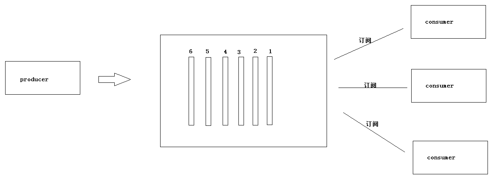
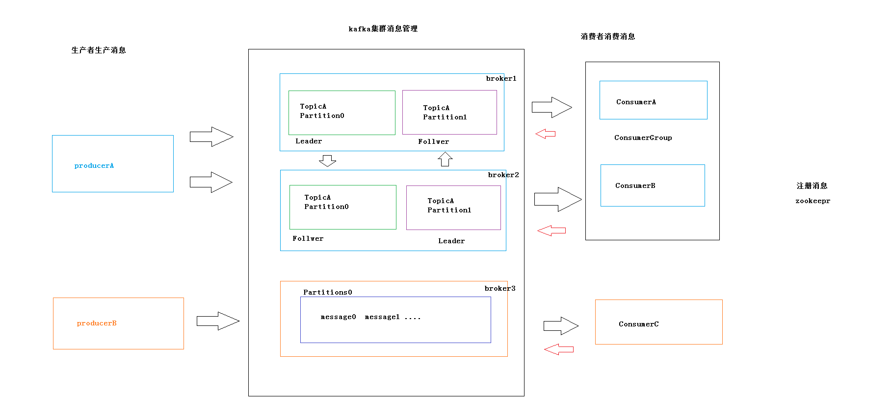

# Kafka  概述

## 定义

kafka是一个**分布式**的基于**发布/订阅**模式的消息队列，主要应用于大数据**实时**处理领域。

## 消息队列

### 传统消息队里的应用场景

#### 同步处理

#### 异步处理

#### 优势

- 解耦

允许你独立的扩展或修改两边的处理过程，只要确保他们遵守同样的接口约束

- 可恢复性

系统的 一部分组件失效时，不会影响到整个系统。消息队列降低了进程之间的耦合度，所以即使一个处理消息的进程挂掉，加入队列中的消息仍然可以在系统恢复后继续处理。

- 缓存

有助于控制和优化数据流经过系统的速度，解决生产消息和消费消息的处理速度不一致的情况。

- 灵活性&峰值处理能力

在访问数据量暴增的情况下，应用仍然需要继续发挥作用，但是这样的突发流量不常见，如果为已能力处理这类峰值访问为标准投入资源随时待命无疑是巨大的浪费，使用消息队列能够使关键组件叮嘱突发的访问压力，而不会因为突发的超负荷的请求而完全崩溃。

- 异步通信

  很多时候，用户不想也不需要立即处理消息。消息队里提供了异步处理机制，允许用户把一个消息放入队列，但并不立即处理它。想向队列中放入多少消息就放多少消息然后再需要的时候去处理它

  

### 消息队列的两种模式

-  点对点模式（**一对一**，消费者主动拉取数据，消息手动后消息清除）

  消息生产者生产消息发送到queue中，然后消息消费者从queue中取出并且消费消息，消息被消费后，queue中不再有存储，所以消息消费者不可能消费到已经被消费的消息。queue支持存在多个消费者，但是对一个消息而言只会有一个消费者可以消费

- 发布订阅模式（**一对多**，消费者消费数据之后，不会消除消息）

  消费者生产（发布）将消息发布到topic中，同时有多个消息消费者（订阅）消费该消息，和点对点方式不同，发布到topic的消息会被所有订阅者消费者。

  

  根据生产速度和消费速度问题产生两种消费模式

  - 消费者主动拉取模式------kafka

    缺点：有时候浪费资源，即使没有消息也要一直去询问有没有消息

  - 生产者推送模式

## kafka基础架构

zookeepr0.9版本之前存储offset  0.9版本及以后存储在kafka集群

Producer：消息生产者，就是向kafkabroker发消息的客户端

Consumer：消息消费者，向kafka broker取消息的客户端

Consumer Group：消费者组，由多个consumer组成，消费者组内每个消费者负责消费不同分区的数据，一个分区只能由一个组内的消费者消费，消费者组之间互不影响。所有的消费者都属于某个消费者组，即消费者组是逻辑上的一个订阅者。

Broker：一个kafka服务器就是一个broker，一个集群是由多个broker组成，一个broker可以容纳多个topic

Topic：可以理解为一个队里，生产者和消费面向的都是一个topic

Partition：为了实现扩展性，一个非常大的topic可以分不到多个broker上，一个topic可以分为多个partition，每个parition是一个有序的队列

Replica：副本,为保证及群众某个节点发生故障时，该节点上的partition数据不丢失

Leader：每个分区多个副本的“主”，生产者发送数据的对象，以及消费者消费数据的对象都是leader

Follower：每个分区多个副本中的“从”，实时从Leader中同步数据，保质和leader数据的同步，leader发生故障，某个follwer就会成为新的Leader

# kafka快速入门

