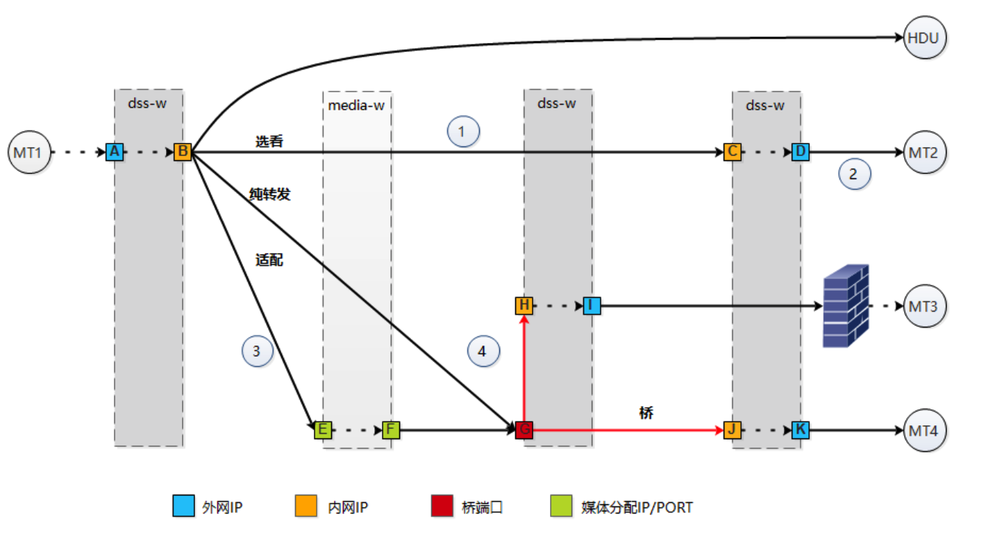

# 无声音图像

### 分析流程

- 寻找链路

  - 链路是否完整

    - ES对应的index------->platform-ads.mediaswitch-{yyyy.mm-vv}
    - 过滤条件 mt_e164=mt_e164 conf_id = conf_e164 direct = recv 时间区

    过滤switches的里的swtich，

    swtich数组长度>=4，链路完整，尾部 是数据源 头部是转发

    - 媒体数据源：拿媒体句柄
    - 终端数据源：拿数据

    

- 数据目的地

  - 终端是否有收到码流 total-frames
    - ES对应index------->platform-nmscollector-mtframes-{yyy.mm-vv}
    - 过滤条件：source.codec_type = enc source.eventid = OPS_MT_MEDIA_INFO_NOTIFY  source.context.mt_e164  source.context.conf_e164
    - Source.frame.total_frames>0 

- 中间流程

  - 当前转发是否有码流 bitrate
    - ES对应的index------>platform-nmscollector-dss-worker-{yyy.mm-vv}
    - 过滤条件 source.eventid = EV_DSS_PORT_STATIS_NOTIFY  source.conf_e164
    - source.rtp_info.statis.updp_pkt.bytes_rate.cur>0

- 数据源

  - 正在接受的媒体是否正在编码 total-frames
    - ES对应index------->platform-nmscollector-platformframes-{yyy.mm-vv}
    - 过滤条件source.codec_type = enc source.eventid = OPS_PLATFORM_MEDIA_INFO_NOTIFY  
    - Source.frame.total_frames>0 
  - 正在接受的终端是否正在编码 total-frames
    - ES对应index------->platform-nmscollector-mtframes-{yyy.mm-vv}
    - 过滤条件source.codec_type = enc source.eventid = OPS_MT_MEDIA_INFO_NOTIFY  
    - Source.frame.total_frames>0 

